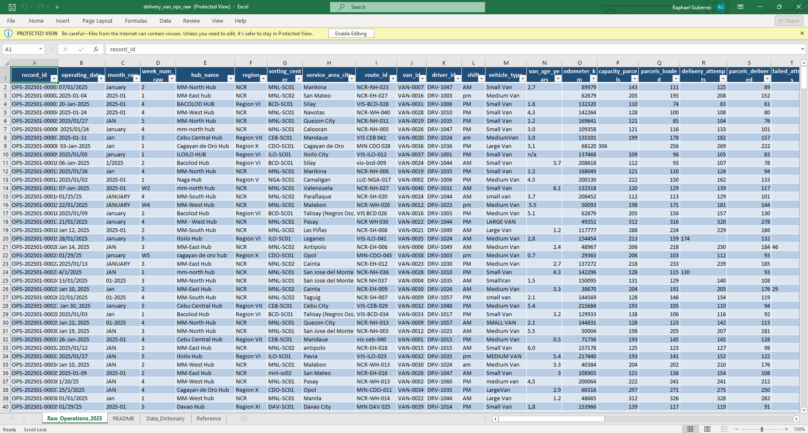
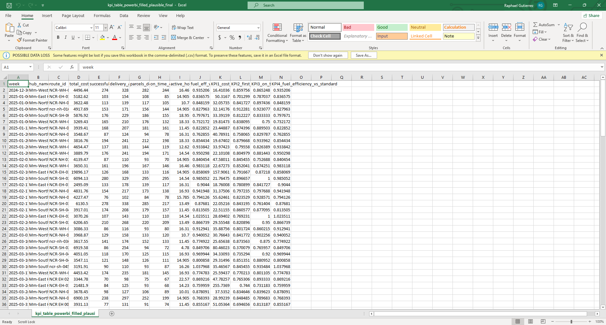
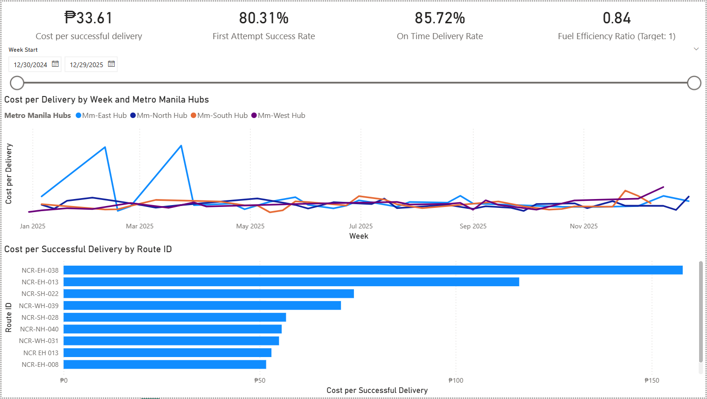
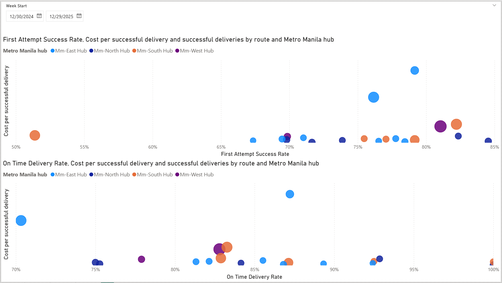
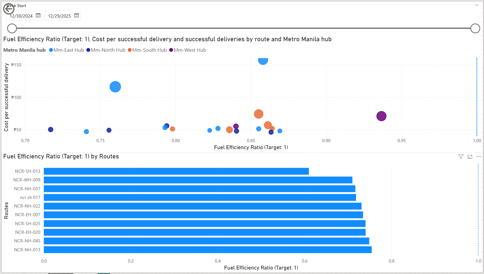
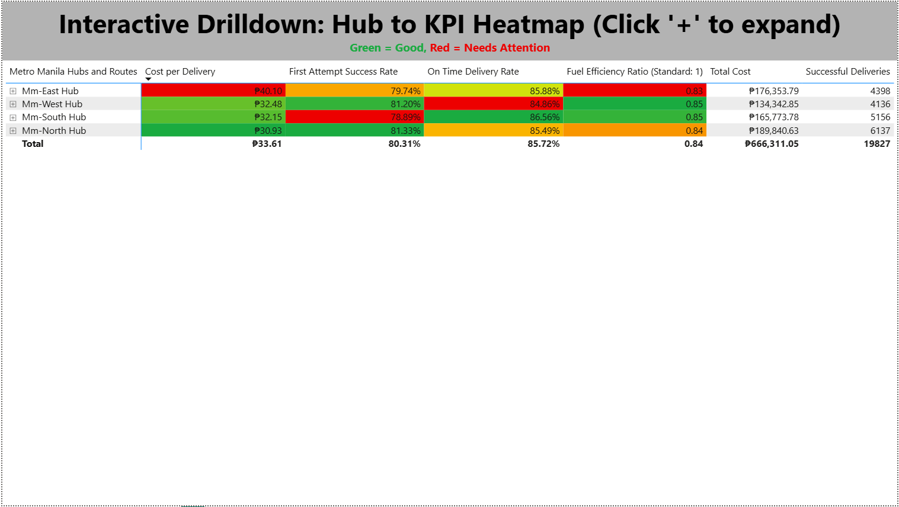

# In Metro Manila, are we spending more to deliver less?

## Problem Statement
In 2025, **St. Matthew's Logistics's** (SML) Metro Manila delivery van operations incurred **5% more expensive** costs per successful delivery (at ₱33.61) than projected (at ₱32), reducing SML's profitability and limiting its ability to scale service reliably. This project seeks to find the quickest, most impactful solution for decreasing costs per successful delivery and increasing total average efficiency by a targeted **5 percentage points**.

## Project Summary
This project investigates why cost per successful delivery is elevated in SML’s 2025 delivery-van operations. I highlighted specific pain points in the dataset so that SML's leadership can act quickly to reduce them. Given the Metro Manila-centric scope, the deep-dive focuses on Metro Manila hubs to keep comparisons consistent and actionable. Using a four-KPI framework, the dashboard highlights which hubs are driving higher costs, and whether these drivers are repeat attempts, delays, or fuel inefficiency. The output is an interactive data dashboard that helps prioritize high-cost, high-volume routes for operational fixes without sacrificing delivery volume or service levels.

## Objective
I set out to create actionable recommendations for lowering **cost per successful delivery** for SML's Metro Manila delivery van operations, via identifying key cost drivers across hubs and routes, based on raw data obtained spanning the timeline of December 2024 to December 2025.

## Scope
This project focused on **Metro Manila hubs** (Mm-East, Mm-West, Mm-North, Mm-South) to keep operating conditions comparable (delivery density + traffic patterns).

## Files
- Raw data: `data/raw/delivery_van_ops_raw.xlsx`
- Cleaned dataset: `data/processed/kpi_table_powerbi_filled_plausible_final.csv`
- Cleaning notebook: `notebooks/datacleanup.ipynb`
  - You may also check out the notebook via the [Google Colab link](https://colab.research.google.com/drive/13uCNcH3-YWD2DtoeiY_q2GDQ6iDASim3?authuser=1#scrollTo=T9OKpEM1eaI8).
- Power BI dashboard: `powerbi/portfolio.pbix`

## Raw Data Screenshot

## Cleaned Data Screenshot

## Methodology Summary
- Dataset preparation and cleanup via **Google Colab Python Notebook** (Pandas)
  - Addressed “impossible zeros” (activity present but fields recorded as 0) using rule-based fills from typical hub/route behavior. Adjusted rows were flagged for transparency.
- Secondary dataset refinement with **Microsoft Excel**.
- Data visualization built with via **Microsoft Power BI**.
- ChatGPT AI Assistance refined via prompt engineering and machine learning, using the zero-shot, few-shot, and chain-of-thought methods in order to refine AI insight responses for this project.

## Core KPIs and Target Values
1. **KPI 1: Cost per Successful Delivery (PHP)** = Total Cost / Successful Deliveries
- Current Metro Manila Average: **₱33.61**
- Target Average: **<=₱31.5**
2. **KPI 2: First Attempt Success Rate (%)** = Parcels Delivered / Delivery Attempts
- Current Metro Manila Average: **80.31%**
- Target Average: **>=85%**
3. **KPI 3: On-Time Delivery Rate (%)** = On-time Deliveries / Parcels Delivered
- Current Metro Manila Average: **85.72%**
- Target Average: **>=90%**
4. **KPI 4: Fuel Efficiency vs Standard (ratio)** = Actual km/L / Typical km/L
- Current Metro Manila Average: **0.84**
- Target Average: **>=0.9**

## Dashboard Screenshots

**Page 1 — Executive Summary**: This is an overview of the dashboard's talking points.

**Page 2 — Diagnostics**: This is the diagonistics page of the dashboard, elaborating further on delivery van performance according to the metrics.

**Page 3 — Fuel & Efficiency**: This is a deeper dive into the fuel efficiency of each Metro Manila hub route. The scatter chart (top) is for the 20 most fuel-efficient routes, and the bottom chart is for the 10 least fuel-efficient routes.  

**Page 4 — Drilldown Heatmap**: The final page is an interactive, color-coded drilldown of the performance of each Metro Manila hub route, divided further by area hub.

## Key Insights

1. **Mm-North** is St. Matthew Logistics's top performing hub in Metro Manila.
- It has the lowest cost per delivery among SML's four Metro Manila hubs.
- It also has the highest First Attempt Success rate among the four Metro Manila hubs.
2. In contrast, **Mm-East** is St. Matthew Logistics's weak link in its Metro Manila hubs.
- Its average cost per delivery in 2025 was **₱40.10**, **26%** higher than the average cost per delivery between the North, West, and South hubs.
- Its fuel efficiency ratio across its routes is also the weakest in 2025 **(0.83)**, being 2 percentage points lower than the West and South hubs.
3. **Mm-South** is SML's weakest Metro Manila hub in its First Attempt Success rate.
- At **78.89%**, it, along with the East hub, falls below the **81.27%** average success rate of the North and West hubs.
4. However, even with Mm-North's relatively strong performance, all of St. Matthew Logistics' Metro Manila hubs have room for improvement in efficiency, beyond just lowering costs per delivery.
- Only an 80.31% First Attempt Success rate average
- Only an 85.72% On Time Delivery rate average
- Only a 0.84/84% Fuel Efficiency ratio on average

## Recommendations
1. **Focus on Mm-East's efficiency pain points**
- It has the highest cost per delivery **(₱40.10)** and lowest fuel efficiency ratio **(0.83)**.
- This will reduce average costs per delivery by at least **5 percentage points**, while also improving SML's Metro Manila fuel efficiency ratio by at least **2 percentage points**.
2. **Reduce Mm-South's reattempts**
- It has the lowest first-attempt success rate **(78.89%)**.
- Fewer reattempts means less fuel, less uptime, and ultimately, lower costs per delivery.
3. **Target Mm-West's on-time delivery performance**
- It has the lowest on-time delivery performance **(84.86%)**.
- Less overtime and delays means less uptime, resulting in greater efficiency and lower costs per delivery.

**I recommend going with Option 1. Mm-East's issues are glaring enough to substantially drag overall efficiency down. Tackling Mm-East's issues first will both clean up and standardize operational efficiency for St. Matthew Logistics's operations in Metro Manila, easing operations into later efficiency-driven initiatives.**
